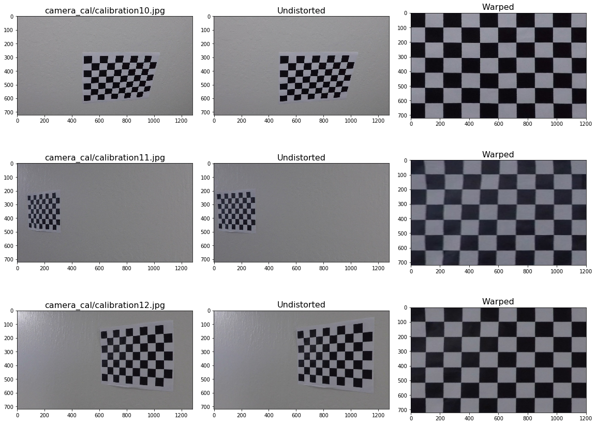
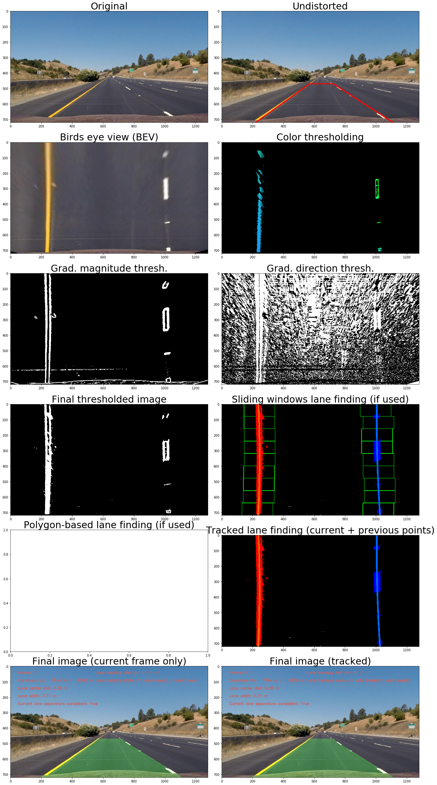
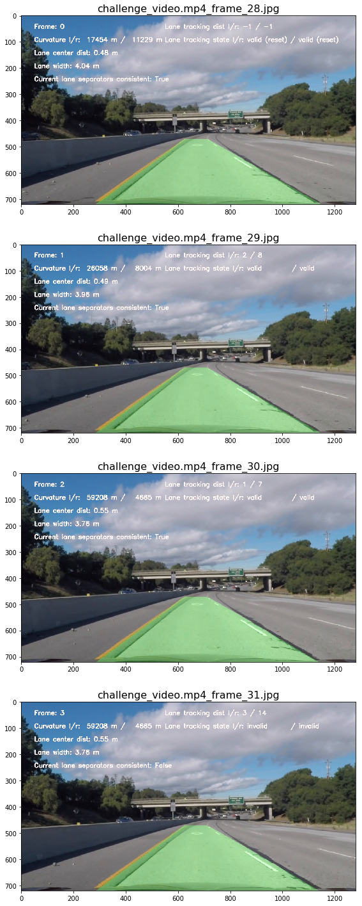

# Advanced Lane Finding Project (using traditional CV techniques)

The goals / steps of this project are the following:

- Compute the camera calibration matrix and distortion coefficients given a set of chessboard images.
- Apply a distortion correction to raw images.
- Use color transforms, gradients, etc., to create a thresholded binary image.
- Apply a perspective transform to rectify binary image ("birds-eye view").
- Detect lane pixels and fit to find the lane boundary.
- Determine the curvature of the lane and vehicle position with respect to center.
- Warp the detected lane boundaries back onto the original image.
- Output visual display of the lane boundaries and numerical estimation of lane curvature and vehicle position.


```python
%pylab inline
%load_ext autoreload
%autoreload 2

from ipywidgets import interact, interactive, fixed, interact_manual
import ipywidgets as widgets
import glob
import os
```

    Populating the interactive namespace from numpy and matplotlib


# Implementation 

The implementation can be found in the `LaneDetector` class in [lane_detector.py](lane_detector.py), please check it out for the actual code.


```python
from lane_detector import LaneDetector
detector = LaneDetector()
```

# Calibration

Calibration is done using OpenCV's `cv2.calibrateCamera` function on the provided checkerboard images. On 3 out of the 20 provided calibration images `cv2.findChessboardCorners` failed to find all corners (as the image only contained a part of the checkerboard), so only the remaining 17 were used for calibration. The calculated `mtx` and `dist` are saved in the class and are pickled, so calibration can simply be loaded when needed.


```python
calibration_images = glob.glob('camera_cal/calibration*.jpg')
ret, mtx, dist = detector.calibrate_camera(calibration_images, grid_size=(6, 9))
detector.save_calibration()
```

    Widget Javascript not detected.  It may not be installed properly. Did you enable the widgetsnbextension? If not, then run "jupyter nbextension enable --py --sys-prefix widgetsnbextension"


    
    Calibrating using 17 images, could not find corners on 3 images


Some sample images can be seen below - the first column contains the original image, the second one is the undistorted and the third one is a warped one. It can be seen that the calibration is not perfect, as lines that are supposed to be straight are actually a bit wobbly. This could be partially caused by the fact that the calibration target does not seem to be perfectly flat on the wall.


```python
detector.show_calibration_results(calibration_images[1:4], grid_size=(6, 9))
```





# Processing a single image

An overview of all the major steps involved in processing a single image can be seen below. Originally I started using Jupyter widgets to tune the parameters, but eventually there were so many of them that I gave up on the interactivity.


```python
detector.load_calibration()
detector.set_mode('image')
detector.reset_tracker()
interact(detector.process_image,
         debug=fixed(True),
         tracking_enabled=False,
         image=widgets.Dropdown(value='straight_lines1.jpg', options=os.listdir("test_images/")),
         sobel_kernel=widgets.IntSlider(value=7, min=3, max=21, step=2, continuous_update=False),
         #s_thresh=widgets.IntRangeSlider(value=(130, 255), min=0, max=255, continuous_update=False),
         mag_thresh=widgets.IntRangeSlider(value=(20, 255), min=0, max=255, continuous_update=False),
         dir_thresh=widgets.FloatRangeSlider(value=(0.0, 0.6), min=0.0, max=1.6, step=0.05, continuous_update=False),
         top_width=widgets.IntSlider(value=154, min=50, max=200, step=2, continuous_update=False),
         top_offset=widgets.IntSlider(value=6, min=-30, max=30, step=2, continuous_update=False)
        )
```


    <function ipywidgets.widgets.interaction.interact.<locals>.<lambda>(*args, **kwargs)>





## Major steps of processing a single image

Processing a single image is performed by the `process_image` function, and the steps described below can be easily seen there. For each major step the corresponding helper function is written in the subtitle below. 

### Undistort

Undistort the input image using the calibration matrix previously calculated

### Perspective transform to bird's-eye view (`_warp`)

4 corners of a trapezoid are selected on the original image that most likely correspond to a rectangle (the selection was done on the straight lane images using the lane markers). A perspective transformation matrix is calculated that maps these points to a real rectangle, resulting in the bird's-eye view (BEV) image of the lane. The correctness of the transformation was verified visually. However this method does not take into account yaw, pitch and roll of either the vehicle or the road, so the mapping is not perfect on all the frames.

### Thesholding (`_threshold`)

Thersholding is applied on the BEV image. Two different types of thresholding is performed:
- Gradient detection is applied on the grayscale image, then the magnitude and direction of the gradient is calculated for each point, and all points are kept where the magnitude is large enough and the direction is not too far from vertical.
- The original image is converted to the `HLS` color space and two separate filters are applied - one that highlights brigh white areas (high L and low S), and another that highlight vivid yellow patches (appropriate H and not-too-low S).
The thresholds are set to be fairly conservative, so these two methods usually find different points on non-trivial images, hence their results are added together to get the final thresholded image.

### Lane detection (`_find_lane_separators`)

Lane detection can be done in one of two ways:
- If no prior information is given (e.g. on the first frame) then first the base point is calculated for both the left and right separators by finding the x position with the highest peak in the histogram. After this a series of windows are used to track the lane from the bottom towards the top of the image, where the center position of the windows are adjusted based on the points in the previous window. This makes it possible to track heavily curved separators.
- If lane detection was successful in the previous frame then the polynomial fitted in the previous frame is given as a prior. In this case all pixels are treated as separator points from the thresholded image that fall in a given range of this polynomial.

After finding all pixels of the lanes with one of the above methods, a second order polynomial is fitted to these points, and is sampled at every y pixel to get a smooth representation.

### Tracking (`_track_lane_separators`)

Detailed below in a separate chapter

### Lane metrics calculation (`_measure_curvature` and `_measure_lane_center_distance`)

Curvature is calculated for each lane separator separately using the best fit polynomial. Lane width and lane center distance are calculated from the same polynomial, by sampling it at the bottom of the image. A hand-coded pixel-to-meters mapping value is used for transforming these values to real units, which is most likely imperfect (partially due to lazy measurements, partially due to the fact the the BEV projection introduces an error on non-flat road surfaces).

### Re-projection (`_get_final_image`)

The detected lane is projected back to the undistorted image using the inverse of the BEV transformation and the lane is drawn as an overlay on the image. Additionally some debug information is drawn on the image to make it easy to read these when watching the final video.


```python
# Save output of sample images to output folder, as requested.

image_fns = [os.path.basename(p) for p in glob.glob("test_images/*")]
detector.set_mode('image')

for image_fn in image_fns:
    if image_fn.startswith('challenge_video.mp4'):
        continue
    detector.reset_tracker()
    res = detector.process_image(image_fn)
    plt.savefig("output_images/{}".format(image_fn))
```

# Tracking

On top of per-frame detections, elementary tracking is also used when processing a video (or multiple image frames).

The best fit polynomial and the detected lane separator pixels from the `n` last frames are saved and later used as a prior, for consistency checks, and also smoothing.

## Tracking as a prior

If a polynomial is available for either separator from the previous frame then this is used as a prior for lane finding in the next frame, as described in the single image processing section.
When looking at the single image debug plots, in these cases it can be seen that the subplot with the sliding windows is not shown, but the next subplot is filled.

## Tracking for temporal consistency

If a polynomial is available for either separator then a metric is calculated to verify the temporal consistency of the given separator. This metric is currently the average distance between the two polynomials (in pixels) and can be seen in the upper right corner of the image. If this exceeds a threshold then the current detection is rejected as being invalid and the previous best polynomial is used in the current frame.

In the top right corner of the image the `Lane tracking dist(ance) l/r` and the `Lane tracking state l/r` values show the distance metric for each separator, and whether the separator is accepted (valid) or rejected (invalid).

## Tracking for smoothing

If the current detected separator is consistent with the previous ones then the currently detected pixels are merged together with the `n` last detected pixels and a new polynomial is fit to these (this is called the `best fit`). This provides smoothing across frames and reduces wobbliness on the video. There could be much more sophisticated ways of doing this, but it gets the job done.

When looking at the single image debug plots, this can be seen on the subplot `Tracked lane finding`.

When processing a single image, both the tracked and untracked separators and values are displayed in the last row of the debug plot. When processing a video, only the tracked output is generated.


```python
image_fns = ["challenge_video.mp4_frame_{}.jpg".format(i) for i in range(28, 32, 1)]
detector.process_multiple_images(image_fns)
```





# Videos


```python
detector.process_video('project_video.mp4'
                       #, subclip_range=(0, 5)
                      )
```

    [MoviePy] >>>> Building video output_videos/project_video.mp4
    [MoviePy] Writing video output_videos/project_video.mp4


    100%|█████████▉| 1260/1261 [05:30<00:00,  4.05it/s]


    [MoviePy] Done.
    [MoviePy] >>>> Video ready: output_videos/project_video.mp4 
    


```python
detector.display_video_in_notebook('output_videos/project_video.mp4')
```


        <video width="960" height="540" controls>
          <source src="output_videos/project_video.mp4">
        </video>
        


```python
detector.process_video('challenge_video.mp4'
                       #, subclip_range=(0, 5)
                      )
```


```python
detector.display_video_in_notebook('output_videos/challenge_video.mp4')
```


        <video width="960" height="540" controls>
          <source src="output_videos/challenge_video.mp4">
        </video>
        


```python
detector.save_every_nth_frame = None
detector.process_video('harder_challenge_video.mp4'
                       #, subclip_range=(3, 8)
                      )
```


```python
detector.display_video_in_notebook('output_videos/harder_challenge_video.mp4')
```


        <video width="960" height="540" controls>
          <source src="output_videos/harder_challenge_video.mp4">
        </video>
        


# Discussion

The pipeline works well for the `project_video` which was the original goal, makes a few but important errors on `challenge_video` (mostly fooled by bithumen stripes), and fails miserably for `harder_challenge_video`.

Some important changes I would make if I were to improve it:

- Calculate a single lane curvature value instead of two separate ones per separator. Also double check if the pixel-to-real-world conversion is correct (now most likely it is not).
- Check why the lane widths fluctuates across frames, leading to a fluctuation in the lane center distance value as well. (Probably improvements to polynomial fitting and tracking discussed below would improve the situation.)
- Improve the detection distance. The trapezoid used for the perspective transform would need to be re-set for this, and other dependent parameters re-adjusted (e.g. y-pixels-per-m).
- Add regularization when fitting the polynomial to the lane points. If only a short section (e.g. a dashed lane marker) is detected on the image, the fitted polynomial can have weird shapes due to the second order term in the polynomial. Adding regularization on the terms (e.g. by using [Ridge regression](https://scikit-learn.org/stable/modules/linear_model.html#ridge-regression-and-classification)?) could reduce this.
- There are a couple of other optimizations to fitting that I would try. Currently all previous points are considered with the same weight as the current pixels - this could be changed to give smaller weight to older pixels. Similarly smaller weight could be assigned to points that are further (and thus are less precisely detected). 
- Improve lane separator polynomial fitting by adding a term to enfore they are parallel - sometimes only a single dashed separator can be seen on one side, but a full solid separator is present on the other side. In these cases considering both separators when fitting the polynomials would help, as the solid separator could 'guide' the polynomial for the other separator as well.
- Improve lane validity checking by adding new criteria: lane separators are not crossing, lane separators are roughly parallel
- Add egomotion information, both for detecting the car's changes in yaw/pitch/roll, and to be able to correctly transform previous frames into the current one.
- Get labelled images and perform automatic parameter tuning
- Figure why the current calibration is imperfect and fix it
- Clean up the code, because some internal functions rely on a long list of parameters, while others make heavy use of the object state, and it is hard to follow. Also there are some redundant values stored, inconsistent names, etc.
